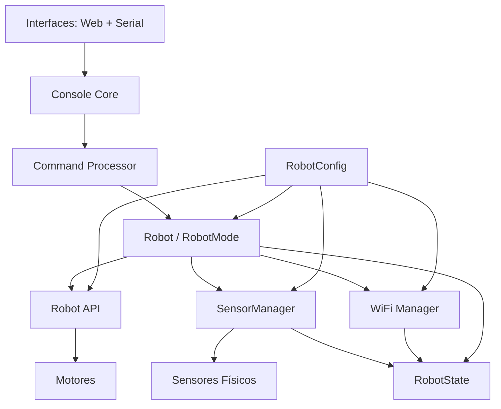
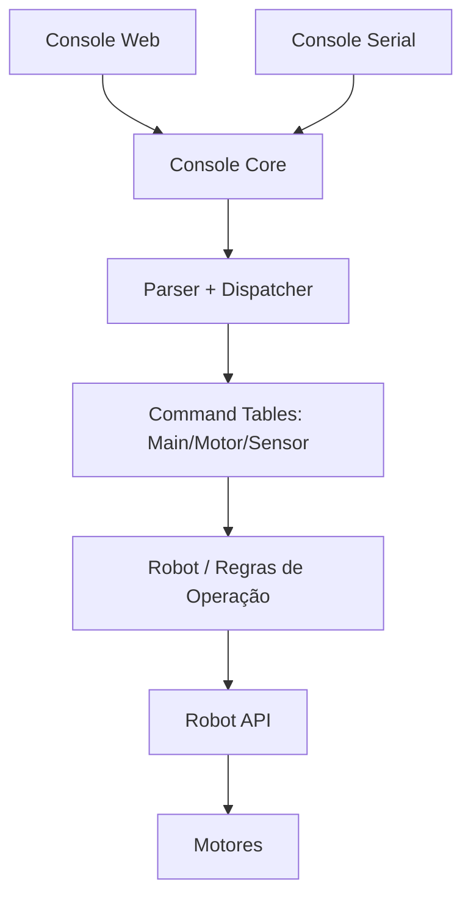
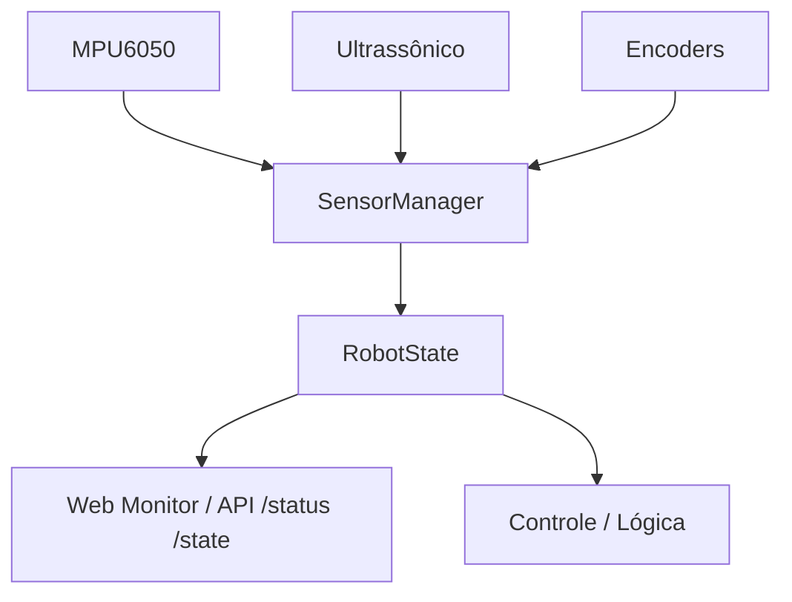
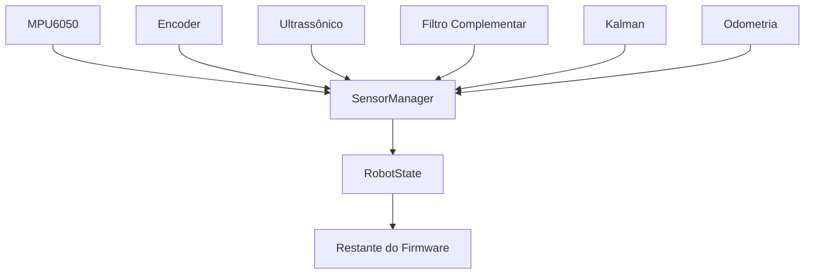
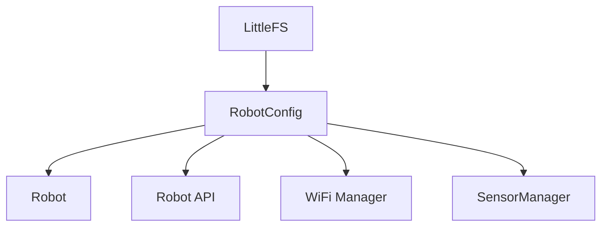

# Arquitetura do Firmware

Este documento descreve a arquitetura atual do firmware do robô, com foco em separação de responsabilidades, fluxo de comandos e fluxo de sensores.

## 1. Visão Geral de Camadas

### Resumo
- As interfaces (Web e Serial) apenas transportam comandos e exibem respostas.
- O processamento de comandos é centralizado no Console Core.
- O `Robot` define comportamento (`RobotMode`) e interface ativa (`InterfaceMode`).
- A `Robot API` é a fronteira entre decisão e execução física (motores/drivers).
- O `SensorManager` encapsula aquisição de sensores e alimenta o `RobotState`.
- O `RobotState` é a fonte única de estado para APIs e telas.
- O `RobotConfig` centraliza parâmetros persistentes (carregados do LittleFS).

### Regra de Governança do RobotState

O `RobotState` deve ser tratado como **somente leitura** para módulos consumidores.

Regra arquitetural:

> Cada módulo é responsável por atualizar apenas a parcela do estado que lhe pertence. Os demais componentes apenas consultam o `RobotState`.

Isso evita inconsistência por escrita cruzada e mantém rastreabilidade da origem de cada dado.

## 2. Fluxo de Comando (Web/Serial)

### Observações
- Comandos podem ser enviados por qualquer interface e cair no mesmo interpretador.
- Comandos qualificados funcionam em qualquer prompt (ex.: `MOTOR F 120`, `SYSTEM STATUS`).
- A resposta é espelhada para Serial e Web via saída unificada do console.

## 3. Fluxo de Sensores

### Observações
- Módulos acima do `SensorManager` não dependem do hardware específico.
- `RobotState` oferece snapshot consolidado para monitoramento e decisões.

### Evolução Prevista do SensorManager

Com essa abordagem, o restante do firmware permanece estável mesmo com evolução da pilha de sensores.

## 4. Scheduler (Loop Principal)

O loop principal utiliza frequências diferentes por responsabilidade:

- Sensores (`SensorManager`): ~200 Hz (5 ms)
- Controle + Motores: ~50 Hz (20 ms)
- WiFi/API Web: ~10 Hz (100 ms)
- Console: orientado a eventos (entrada serial/web)

Isso melhora previsibilidade e reduz acoplamento temporal entre módulos.

## 5. Estruturas-Chave

### RobotMode (comportamento)
- `MODE_IDLE`
- `MODE_MANUAL`
- `MODE_AUTONOMOUS`
- `MODE_CALIBRATION`

### InterfaceMode (interface ativa)
- `UI_CONSOLE`
- `UI_CONTROL`
- `UI_MONITOR`
- `UI_CONFIGURATION`

### RobotState (estado consolidado)
Inclui, entre outros:
- modo e interface
- PWM esquerdo/direito
- encoders
- distância
- IMU (aceleração e giroscópio)
- conectividade WiFi
- uptime

### RobotConfig (parâmetros persistentes)
Responsável por carregar e distribuir configurações do sistema, por exemplo:
- PWM máximo e frequência de PWM
- SSID/senha
- constantes de PID
- limites de sensores
- parâmetros da IMU

Fluxo recomendado:

## 6. Princípios Arquiteturais Atuais

1. Um único núcleo de comandos para todas as interfaces.
2. Separação entre comportamento do robô e tipo de interface.
3. Fonte única de estado para observabilidade e integração.
4. Camada de sensores abstraída para suportar evolução de hardware.
5. Evolução incremental com compatibilidade de comandos legados.
6. Governança explícita do estado: escrita por domínio, leitura global.

## 7. Próximas Evoluções Recomendadas

1. `RobotConfig` com persistência em LittleFS (`config.json`, `pid.json`, etc.).
2. Event manager para reações orientadas a evento (ex.: obstáculo crítico).
3. Watchdog lógico para falhas de sensores e modos degradados.
4. Diagnóstico expandido com relatório estruturado para apresentação do TCC.
